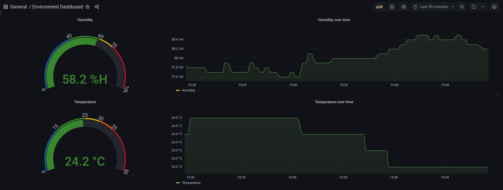

# Humipy

Grafana dashboard + Prometheus exporter for visualizing the temperature and humidity using a Raspberry Pi.
I use it to prevent molt in my bathroom.

I tried to keep the setup as simple as possible.
Instead of executing dozens of commands in the terminal, a single `docker-compose up -d` should be enough.



## Installation

- Raspberry Pi 4 with 2 gb RAM (other PIs may also work, but I wanted ARM 64 bit)

### DHT22

The DHT22 sensor needs to be connected to the PIs GPIO pins as follows:


(*Source: https://upload.wikimedia.org/wikipedia/commons/1/10/Raspberry_Pi_4_Model_B_-_Top.jpg*)

```txt
      DHT-22

┌────────────────────┐
│                    │
│   #############    │
│   #############    │
│   #############    │
│   #############    │
│   #############    │
│                    │
└───┬───┬───┬───┬────┘
    │   │   │   │
    │   │   │   │
    │   │   │   │
   PWR Data    GND
```

The DHT Pins are numbered from left to right from 1 to 4.
Connect Raspi and DHT22 with three (3) jumper cables:


-  5V --> PWR (Pin 1)
-  GND  --> GND (Pin 4)
-  GPIO4 --> Data (Pin 2)
- yes, the third pin of the DHT22 is not connected

## Prepare Raspi

Install Python and pip:

`sudo apt install python3-dev python3 python3-pip -y`

Install Docker + Docker-compose (reboot required)

```bash
curl -sSL https://get.docker.com | sh
sudo usermod -aG docker ubuntu
sudo pip3 install docker-compose
sudo systemctl enable docker
sudo reboot
```

Now get this repo and then run `docker-compose up -d`

## HTTPS

It is also possible to access the Grafana Dashboard over HTTPS.
Depending on your security requirements and/or threat model it might be a good idea to enable HTTPS.

Generate a self signed certificate for your domain:

`sudo openssl req -x509 -nodes -days 365 -newkey rsa:2048 -keyout ./nginx/nginx-selfsigned.key -out ./nginx/nginx-selfsigned.crt`

Replace the content of `./nginx/nginx.conf` with:

```txt
server {
  listen 80;
	listen [::]:80;
	server_name _;
	return 301 https://$host$request_uri;
}

server {
  listen 443 ssl;
  listen [::]:443 ssl;
  include ssl/self-signed.conf;

  location / {
   proxy_set_header Host $http_host; 
   proxy_pass http://grafana:3000/;
  }
}

```
